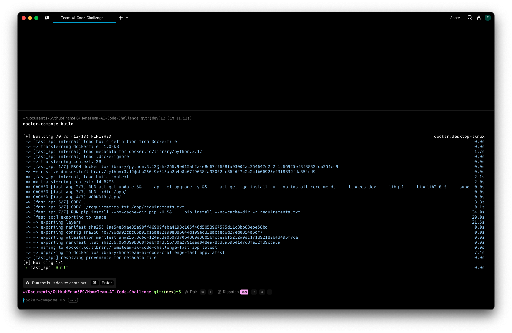
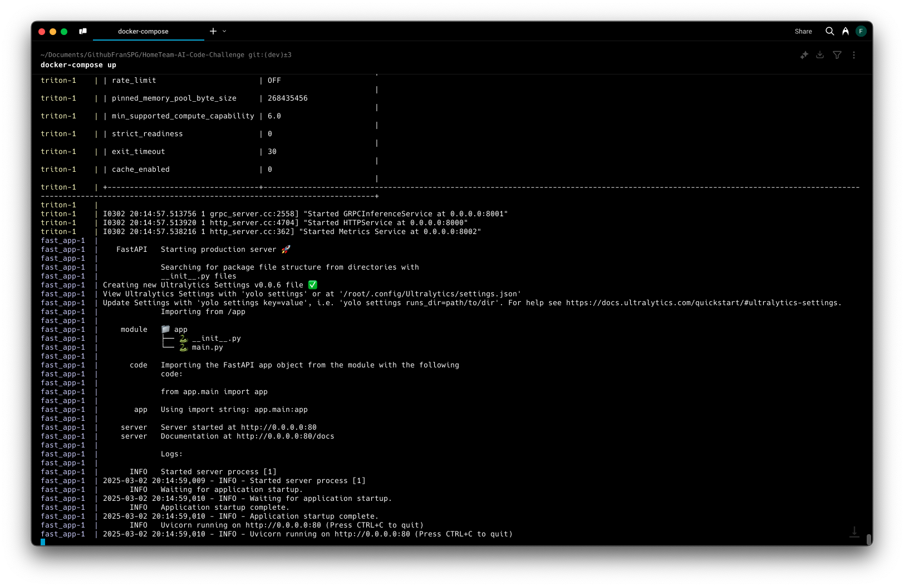
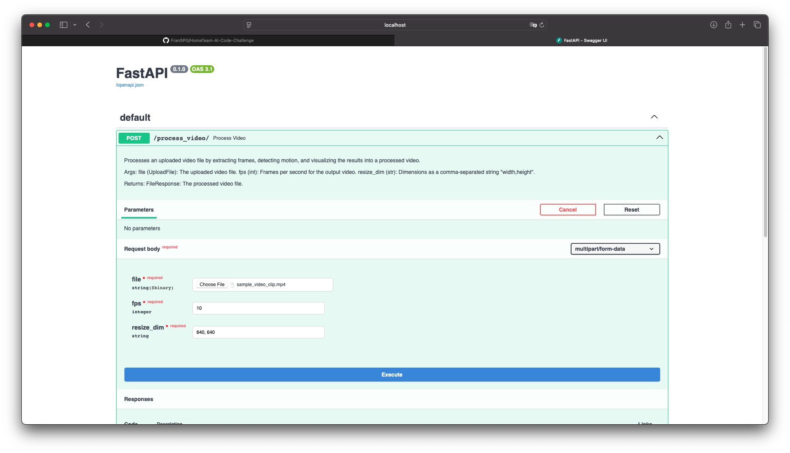

# HomeTeam-AI-Code-Challenge

Code challenge for the position AI Engineer at HomeTeam.

---

# How to reproduce the solution

## First Step

Clone this repo 
``` bash
git clone git@github.com:FranSPG/HomeTeam-AI-Code-Challenge.git
cd HomeTeam-AI-Code-Challenge 
```

---

## Second step
``` bash
docker-compose build 
```

---

## Third step
``` bash
docker-compose up 
```


## Fourth step
Open the following link with your browser:

http://localhost/docs#/default/process_video_process_video__post


## Fifth step
Click the 'Try Out' button and fill up the parameters



Once the process is finished you will get a link to download the processed video to your local machine.


---
# My approach

I decided to design a continuous operational pipeline with a production-first mindset, 
prioritizing how the model would be deployed and used in the real world rather than focusing solely on the model itself.
For the model, I opted for the out-of-the-box YOLOv11m model,
as my experience suggested that it would provide an acceptable level of performance 
for the sample video provided. I wanted to avoid over-engineering the model and instead, 
focused on other critical aspects of the solution. Of course, there’s always room for improvement
from the model’s perspective. For instance, adjusting confidence thresholds, using masks to prevent 
detections in undesired areas, and fine-tuning the model with annotated data specific to this kind of 
fisheye-like camera would likely improve detection accuracy in this particular case.

To serve the model, I chose NVIDIA Triton Inference Server. 
This choice allows me to easily abstract away the model management from the code, 
providing a scalable, efficient, and production-ready environment to serve the model,
enabling smooth inference operations.

For the API, I leveraged FastAPI because of its integration with Swagger.
This gave me an easy way to expose an endpoint with a user-friendly interface,
allowing for fast iterations and testing with different videos, frame rates, and resolution configurations.

I packaged everything using Docker and managed the containers with a Docker Compose file.
This setup streamlines deployment and makes it easy to manage dependencies and configuration.
